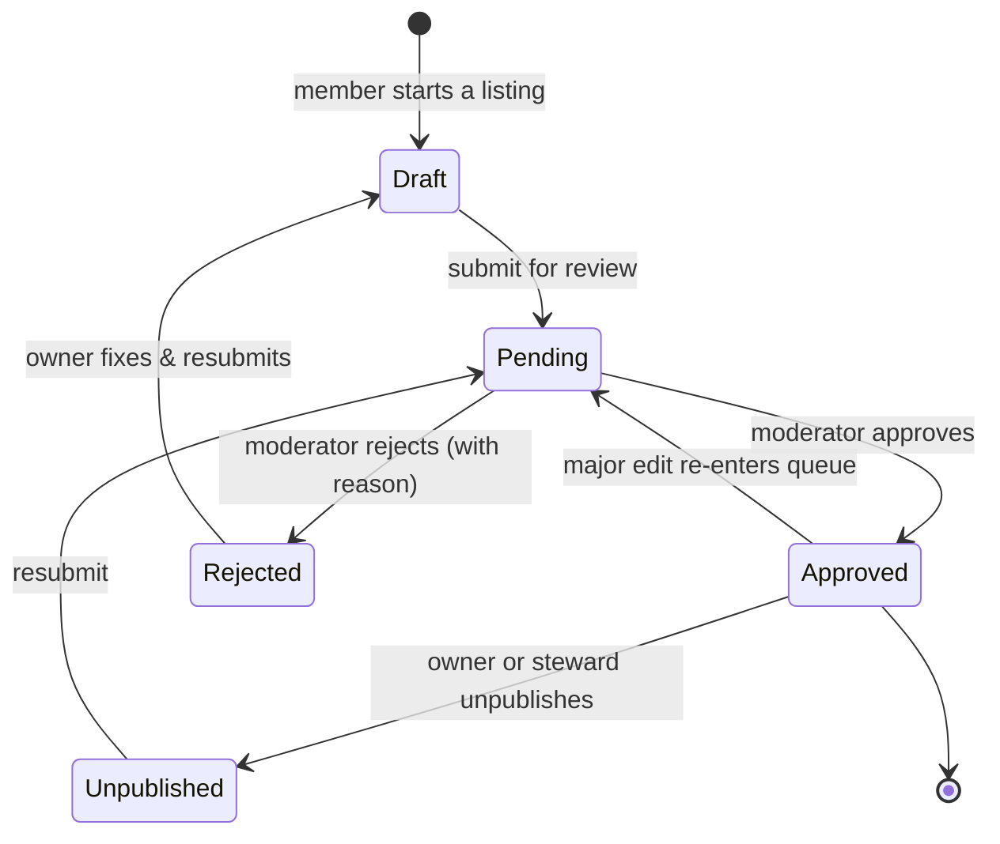
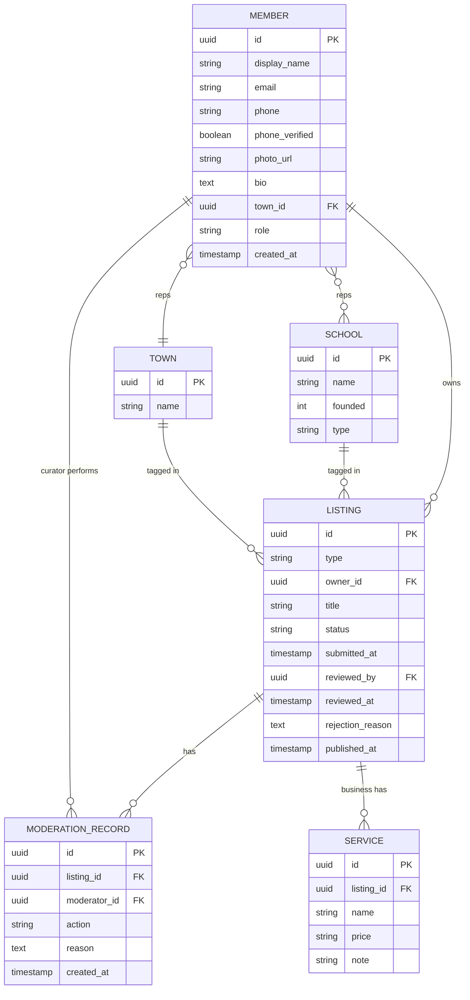

# Oguaa Platform — Project Specification

**Working name:** Oguaa *(final name to be confirmed — see Open Decisions)*
**A community platform for Cape Coast (Oguaa), Central Region, Ghana**
**Document status:** v0.1 — living document
**Owner:** Community vehicle (to be incorporated), founder-convener leading.
**Audience for this document:** Anyone — a human contractor, a designer, a moderator, or an AI build agent — should be able to read this and build, populate, and operate the platform without further context.

> This is an independent community initiative. It is not a commercial product of any company. Its legitimacy depends on being, and being seen as, *ours*.

---

## 1. What this document is

This is the single source of truth for the platform: why it exists (philosophy and objectives), how it must be governed and kept legal, and exactly what is to be built (functional and technical specification), in what order, and how we know each part is done.

Read sections 2–5 to understand intent. Read sections 6–12 to build. Read 13–14 before launch. Read 15–16 to plan and verify delivery.

---

## 2. Vision & philosophy

Cape Coast — Oguaa — is one of the richest places in Ghana: the old colonial capital, the global symbol of the diaspora homecoming, the "citadel of education," home of the Fante Confederacy and its 1871 Mankessim Constitution, of the Asafo companies and their flags, of Fetu Afahye. Yet its story is scattered, its talent under-spotlighted, and its people — at home and away — have no shared digital home.

The platform exists to change that, and it leads with **local civic pride and development**. This is a deliberate inversion of the usual "come and invest" pitch. Most hometown projects open by asking outsiders for money and wonder why nobody answers. We do the opposite: we build the thing the people of Oguaa genuinely love and feel ownership of first, and investment and the diaspora arrive afterwards — because by then there is something real, organised, and credible to come back to.

The sequence is:

> **pride → cohesion → visibility → investment → improvement**

Pride comes first. Investment is downstream of a community that already stands behind its place. A proud, mobilised hometown is impossible to fake and impossible to out-compete — that, not any single feature, is the platform's lasting strength.

The name we work under, *Oguaa*, carries the spirit: this is ours, made by us, for us. The platform is designed so the same model can later be adopted by other Ghanaian towns, one by one — "we ourselves," replicated.

---

## 3. Guiding principles

These principles resolve trade-offs. When a decision is unclear, return here.

- **Residents first, visitors second.** The platform is a mirror that says "this is who we are," aimed at the people of Oguaa. Tourists and the diaspora are welcome and important, but they are not the primary audience and the tone is never built around them.
- **Music is the wedge, not the whole.** Local artists are both the most starved of a spotlight and the most motivated to share — give a musician a real profile and they push it to their own following, which is reach money cannot buy. Music goes through the door first; every other section is treated as equally first-class.
- **One engine, many hats.** Businesses, artists, personalities, memories, tributes, events, and youth opportunities are all the *same shape*: someone creates an entry, it is reviewed, it goes live. We build one submit–review–publish engine with different listing types, not many separate systems. This is what keeps the platform from bloating.
- **Participation is woven in, not bolted on.** Every content section has a way to contribute (submit / nominate / share). The community is a participant, not an audience.
- **The member profile is the heart.** "Rep your town" and "rep your school" are not standalone features; they are *who you are* on the platform. Listings, memories, and events hang off member identity.
- **Ship fast, populate gradually.** Launch a few sections deep (Home + Music) with the rest stubbed, then fill them as content arrives. The structure holds everything from day one; the depth grows.
- **Preserve heritage as a living record.** Capturing the older generation's memories and the city's history is real cultural preservation, not decoration.
- **Safeguard the young.** Anything involving minors is designed conservatively, with consent and protection ahead of convenience (see §8.8 and §14.4).
- **Trust through transparency.** Because it is community-owned, how it is run, moderated, and funded is open.

---

## 4. Objectives & success metrics

### Phase 1 objectives
1. Establish a single, credible online home for Oguaa identity and pride.
2. Give local musicians real profiles and a rotating spotlight, driving traffic to their music.
3. Let any resident, business, or alumnus participate through one moderated engine.
4. Build the member base and the school/town communities that later unlock the diaspora and investment.
5. Preserve heritage — memories, history, culture — as a living, growing record.
6. Surface youth opportunities and young talent.

### Phase 1 success metrics (KPIs)
| Metric | Why it matters |
|---|---|
| Registered members; monthly active members | Core pride/cohesion signal |
| Approved listings, by type | Breadth of participation |
| Active schools and towns | Community formation |
| Memories captured (especially from elders) | Heritage preservation |
| Artist profile views and click-throughs to streaming | Music wedge working |
| Events posted and attended | Connective tissue alive |
| Youth opportunities posted and clicked | Development goal progressing |
| Median time-to-approval | Moderation health |

### Phase 2 objectives (later)
Diaspora register and engagement; project funding ("adopt-a-project"); investment opportunities; mentor-to-youth matching.
KPIs: diaspora members, projects funded, funds mobilised, mentor–mentee matches sustained.

---

## 5. Audiences / users

- **Visitor (unauthenticated)** — browses all public content; cannot contribute.
- **Member** — a registered person with a profile; can submit content and "rep" a town and school.
- **Listing owner** — a member who owns one or more listings (business, artist page, etc.) and maintains them.
- **Curator / moderator** — a trusted member who reviews submissions and approves or rejects them.
- **Steward / admin** — runs the platform: manages curators, configuration, institutions and places, verification, and escalations.
- **Institution admin / office-holder** — a verified member who manages a registered institution's official profile and posts on its behalf (§8.13).
- **Diaspora member (Phase 2)** — a member abroad or elsewhere in Ghana who engages, backs projects, and mentors.

---

## 6. Scope

### In scope — Phase 1 (now; ships fast)
Showcase **and** participation, merged. Member identity, the content sections, the submit–review–publish engine, the member profile, rep your town, rep your school, share your memory, the tribute and memorial section (In Memoriam), events and calendar, the youth opportunities board and young-talent spotlight, the business directory, the music flagship, and an AI writing assistant bar across the admin dashboard. The institutions & authorities registry (§8.13) begins here as a first cut — schools as official, verified profiles, since rep-your-school depends on them — with the fuller authority hierarchy (traditional areas, councils, associations) staged as it is verified.

### In scope — Phase 2 (later)
The diaspora homecoming and investment engine (diaspora register, adopt-a-project, investment opportunities) and full mentor-to-youth matching.

### Out of scope (for now)
- Hosting or streaming audio/video files (we link out — see §8.3 and §14.5).
- Payments / fundraising flows (Phase 2).
- Native mobile apps (Phase 1 is a mobile-first responsive web app; apps can follow).
- Private messaging between members (deliberately excluded in Phase 1, especially anything adult-to-minor — see §8.8/§14.4).

---

## 7. Core concept — members, institutions & the listing engine

Three ideas carry the whole architecture.

**The member profile** is the platform's identity layer. Every contributor has one. It records who you are, the town you rep, and the institution(s) you rep (§8.13). Almost everything else attaches to it.

**The institution profile** is the platform's authority layer. The bodies people affiliate with — traditional areas and councils, schools (basic, senior high, tertiary), associations and Old Students bodies, churches and mosques, civic bodies — are themselves **registered entities with their own official, verified profiles**, not just labels to pick from. A school controls and uses its profile as its official presence; an *office* (Omanhene, headteacher, OSA president) is a position *within* an institution, held by a verified member. See §8.13.

**The listing engine** is one reusable pipeline. A *listing* is any user-contributed entry. It always follows the same lifecycle (create → submit → review → publish) and is always owned by a member. Listings differ only by **type**, which determines the fields shown and where the entry appears:

```
                         ┌─────────────────────────┐
                         │      MEMBER PROFILE      │
                         │  identity · town · school│
                         └────────────┬─────────────┘
                                      │ owns
            ┌───────────────┬─────────┼─────────┬───────────────┬─────────────┐
            ▼               ▼         ▼         ▼               ▼             ▼
       Business         Artist     Person     Memory          Event      Opportunity
        listing         (music)  /personality (story)        listing       (youth)
            └───────────────┴─────────┴────┬────┴───────────────┴─────────────┘
                                           ▼
                          ONE submit → review → publish engine
                        (member accounts · moderation queue · approval)
```

The practical consequence: build the engine, the profile, and the moderation panel **once**; every feature in this document is then either a new *listing type*, a *profile attribute*, or a *view* over data that already exists. This is the no-bloat guarantee.

---

## 8. Functional specification

### 8.1 Accounts & member profile

**Registration & login.** Email or phone sign-up. Phone/WhatsApp number verification (one-time code) is required before a member can submit any listing — this is the primary spam gate and fits how people already operate in Ghana. Minimum self-registration age is 18 (see §14.4 for under-18 handling).

**Profile fields.**
| Field | Notes |
|---|---|
| Display name | Required |
| Photo / avatar | Optional |
| Short bio | Optional |
| Town affiliation | "Rep your town" — see §8.6 |
| School affiliation(s) | "Rep your school" — see §8.5; one or more |
| Links / socials | Optional |
| Verified phone | Required to contribute; not shown publicly by default |
| Role | member / curator / steward (assigned, not self-selected) |

A member may own multiple listings (e.g., a business owner who is also a musician).

### 8.2 The submit–review–publish engine (the listing lifecycle)

Every listing moves through these states:



- **Draft** — owner is creating/editing; not public.
- **Pending** — submitted; sits in the moderation queue; not public.
- **Approved** — live and publicly listed.
- **Rejected** — returned to the owner with a reason; owner may fix and resubmit.
- **Unpublished** — was live, now hidden (owner-requested or steward action).

**Edit policy (default):** minor edits to an approved listing (e.g., hours, phone, links) publish immediately; major edits (name, category, ownership) re-enter the queue. This is configurable; the simplest launch setting sends *every* edit back through review and is relaxed later (see Open Decisions).

**Moderation criteria (the curator's checklist):** real (a genuine entry), local (belongs to Oguaa / Cape Coast), correctly categorised, and appropriate (nothing unlawful, hateful, or harmful). Rejections must carry a short reason.

**Notifications:** the owner is notified on approval and on rejection (with the reason).

### 8.3 Listing types & their fields

All types share the lifecycle, owner, title, status, and timestamps. Type-specific fields:

- **Business** — name, category/sector, short description, **services** (a repeatable list, each with name + optional price/note), location/address, contact (phone, WhatsApp, email, website, socials), opening hours, logo/photos.
- **Artist (music)** — artist/act name, genre(s), bio, photos, **streaming links** (Audiomack, Boomplay, Spotify, YouTube, etc.), socials, booking/contact. *No audio is hosted; we link out only* (§14.5).
- **Person / personality** — name, why notable (historical or living), era, photo, links; feeds the People section and the "sons & daughters" wall.
- **Memory / story** — title, text, optional photo, and tags (school / town / era / festival); feeds the Memory Wall (§8.7).
- **Event** — title, description, date/time, venue/location, organiser, link/contact; feeds the calendar (§8.9).
- **Opportunity (youth)** — title, type (scholarship / internship / apprenticeship / training / job), description, eligibility, deadline, how to apply, provider. Information and outbound links only (§8.8).
- **Tribute / memorial** — a person who has passed: name, dates, traditional title, life story, photo gallery, their school(s)/town/associations, and a collection of **tributes** from the community. Created by a family member, friend, or association on the person's behalf; kept permanently. See §8.11.

### 8.4 Content & showcase sections (sitemap)

The site is organised into the following sections. Each content section includes a clear "submit / nominate" path so its data grows through participation.

- **Home** — the mirror. Rotating artist spotlight at the top, a short "this is Oguaa," entry points to every section, latest wins and upcoming events, and one clear "join / contribute" call.
- **Music** *(flagship — launch deep)* — artists directory (browse by genre); artist profile pages; "The Oguaa Sound" editorial on the local scene, genres, venues, and the city's place in Ghana's music; spotlight & new releases (rotating front-page features); submit / nominate an artist.
- **People** — personalities and icons, historical and living; influencers; notable alumni; the "sons & daughters" pride wall.
- **Heritage & history** — the Castle and the diaspora story; the Fante Confederacy and the 1871 Mankessim Constitution; the Asafo companies and their flags; Cape Coast as the old colonial capital.
- **Culture & festivals** — Fetu Afahye; traditions; chieftaincy and the Oguaa Traditional Council.
- **Visit** — tourism: the Castle, Kakum, the beaches, where to eat and stay, things to do.
- **Education** — the citadel of education: Mfantsipim, Adisadel, Wesley Girls', St. Augustine's, Holy Child, University of Cape Coast — each with an alumni-pride angle that doubles as the network in §8.5.
- **Business & trade** — the directory (§8.1/§8.3), markets, the fishing community, the working city.
- **In Memoriam / Tributes** — the tribute and memorial section (§8.11): a permanent, dignified home for honouring community members who have passed, with life stories, galleries, and tributes from many. Quieter in tone than the rest of the site.
- **Community / get involved** — join and get updates; submit a story, artist, business, or event; celebrate local wins; the events calendar; about the community vehicle; contact.

**Launch depth:** ship **Home + Music** fully populated; stub the rest with structure in place and fill as content arrives.

### 8.5 Feature — rep your school

A member selects their alma mater (Mfantsipim, Adisadel, Wesley Girls', St. Augustine's, Holy Child, UCC, and others as added) and joins that school's space.

- **Why it is the powerhouse:** it plugs straight into Ghana's Old Students Association (OSA) culture — networks that are already organised, loyal, and in the habit of giving back. We do not build communities from scratch; we give existing, motivated ones a home.
- **School space / official profile:** each school's space *is* its official registered profile (§8.13) — its crest, its members, related memories, those it remembers (memorials of departed old students), news, and the official announcements and events its verified office-holders post.
- **Friendly rivalry:** lightweight signals of which school reps hardest and which is most active (member counts, contributions, event turnout). Gamified gently — pride, not pressure.
- **Bridge to youth:** the OSA network is the natural source of the mentors and funders in §8.8.

### 8.6 Feature — rep your town

A member declares and wears their community pride as a profile attribute.

- Default interpretation: pride affiliation with Cape Coast / Oguaa.
- This also seeds the replication vision: the model other towns adopt over time.
- **Open question:** if "town" should instead mean specific quarters/communities within Cape Coast, the taxonomy is configured that way instead (see Open Decisions). Either way it is a profile attribute, not new machinery.

### 8.7 Feature — share your memory

A memory is a listing type (§8.3) on the shared engine.

- A member posts a memory (text + optional photo); it gets a light moderation pass; it lands on the **Memory Wall**, filterable by school, town, era, or festival.
- **Heritage value:** capturing the older generation's recollections is the oral history of Oguaa preserved.
- **Pride fuel:** prompts like "share your Mfantsipim memory" or "your Fetu Afahye memory" are endlessly shareable.

### 8.8 Feature — training the youth

Staged deliberately.

**Phase 1 (now):**
- **Opportunities board** — a listing type: scholarships, internships, apprenticeships, training programmes, jobs. Youth browse and follow outbound links to apply. *Information and links only — no private adult-to-minor contact through the platform.*
- **Young-talent spotlight** — featuring young people doing notable things (with consent / guardian consent where a minor is involved; see §14.4).

**Phase 2 (later):**
- **Mentor-to-youth matching** — pairing alumni/diaspora mentors with students. This is real operational work (matching, and especially vetting people) and carries safeguarding obligations, so it is not launched until a safeguarding policy, identity vetting, guardian consent, and supervised (never private/unmonitored) interaction channels are in place.

**The flywheel this creates:** rep your school → alumni network → alumni mentor and fund current students → those students become proud reps. This is what makes "improve it" work *locally and now*, without waiting on Phase 2 diaspora money.

### 8.9 Feature — events & calendar

- Events are a listing type (§8.3), submittable by members and moderated.
- A calendar view aggregates them, **anchored on Fetu Afahye** as the annual homecoming beat, and ties together school reunions, youth workshops, music gigs, and the festival itself.

### 8.10 Moderation & admin panel

A back-office for curators and stewards.

- **Queue:** all `Pending` listings, oldest first, filterable by type.
- **Actions:** approve; reject with a reason; request changes; unpublish; flag.
- **Curator checklist:** real · local · correctly categorised · appropriate (§8.2).
- **Member & listing management:** search, view, edit, suspend; manage the schools and towns reference lists; assign curator/steward roles.
- **Spam controls:** phone/WhatsApp verification required before submission; rate limits on submissions; ability to block abusive accounts.
- **Audit:** every moderation action is recorded (who, what, when, why).

### 8.11 Feature — tribute & memorial (In Memoriam)

A dignified, permanent place to honour members of the Oguaa community who have passed — loved ones, elders, and notable figures — so their memory is kept and shared. In Ghanaian tradition the departed are honoured by the whole community: family, friends, churches, Old Students, asafo, and associations. This section gives that tradition a lasting digital home, and it doubles as heritage preservation.

A memorial is a listing type (§8.3) on the shared engine, with three differences from every other listing:

1. **The subject has died and cannot hold an account.** A member — a family member, friend, or association — creates the memorial *on behalf of* the departed, as a keeper of their memory.
2. **Memorials are kept permanently.** Unlike other listings, they are not subject to routine unpublishing or expiry. "Their memories stay forever" is a design value, not a nice-to-have. Only the family/keeper or a steward may change or remove a memorial, and family wishes always prevail.
3. **They are multi-voice.** One memorial gathers many tributes — Ghanaian remembrance is collective.

**A memorial page contains:**
- The person's name, any traditional title or honorific, and dates (born–died, or year only).
- Hometown / quarter, and their school(s) and associations — which link the memorial into their school space and town, so "In Memoriam" appears within an OSA's remembrance and a community's pride.
- A life story / celebration of life, and a photo gallery.
- A **light-a-candle / pay-respects** gesture — a gentle, low-effort way for the community to show they remember, with a count of those who have.
- **Tributes** — condolence messages and memories left by many members, each lightly moderated for dignity.
- Optionally, where the family wishes, details of a funeral or celebration-of-life service (which may also be listed as an Event in §8.9).

**Yearly remembrance (like a birthday reminder).** Each memorial carries its key dates — the date of passing and, optionally, the person's birthday — and the platform raises a gentle annual remembrance on those dates, the way a birthday reminder works. On the day, members who follow the memorial are reminded ("Today we remember [Name]"), and the memorial is resurfaced on the In Memoriam section and the home page. This fits Ghanaian custom, where the one-week, forty-days, and yearly anniversaries are observed.

Because remembrance touches grief, it is consent-led and gentle — never a broadcast blast:
- Members choose to remember a person: lighting a candle, leaving a tribute, or following a memorial opts them into that person's annual remembrance, and any reminder can be muted in one tap.
- The memorial's **creator/keeper decides at creation** whether reminders run at all, and whether the **birthday** is observed alongside the passing anniversary — the passing date is the default; including the birthday is their choice.
- Reminders reach people on the channels they already use (in-platform, and email or WhatsApp), respecting each member's notification preferences.

The same recurring-date mechanism can later power living members' birthdays as a community feature, if wanted — built once, used for both (§17).

**Tone & design.** This section is visually quieter and more elegant than the rest of the platform — calm and dignified, not the bright pride energy elsewhere. A tasteful Adinkra motif of remembrance and the immortality of the soul may anchor it. The section's working name is **Yɛnkae** — Fante for "let us remember," a deliberate echo of Yɛn Ara — shown with an *In Memoriam* subtitle so it reads clearly for non-Akan visitors; the exact Fante spelling and diacritics should be confirmed with the community (§17).

**Standing, creation & moderation (extra care).**
- A member creates a memorial and it enters the queue like any listing, but moderation is handled with **heightened sensitivity and verification**: curators confirm the memorial is genuine and respectful and that it is made with the family's awareness rather than against their wishes. A "memorial" of someone still living (a cruel hoax) must be caught and refused.
- A verified family member can **claim and keep** a memorial, correct it, or request its removal — even though memorials are otherwise permanent. Family wishes override.
- Tributes from others are moderated for respect; mockery, abuse, or score-settling on a memorial is never permitted.
- A memorial of a deceased minor is handled with the greatest sensitivity and only with guardian involvement.

**Relationship to other sections.** A notable person who has passed may appear both here and in People (§8.4): the memorial is the place of remembrance, the People entry the place of legacy. The Memory feature (§8.7) and tributes overlap by design — a memory about someone who has died can live on their memorial.

### 8.12 Feature — AI writing assistant bar (admin)

A reusable AI writing aid attached to the admin dashboard's text areas, to help administrators create and improve content faster while staying in **full control of the final words**. It is an admin-only productivity tool, separate from public content; nothing it produces is published automatically.

**Where it appears.** Near rich-text editors and longer text fields throughout the admin dashboard — descriptions, messages, announcements, emails, notes, policy content, editorial/blog content, and similar admin-authored areas. It is built once as a **shared component** and configured per page or input type (which actions appear, default tone, target languages).

**Actions.**
- **Formalize** — rewrite in a more professional tone.
- **Make casual** — rewrite in a friendly, simple, conversational tone.
- **Summarize** — shorten into a clearer, tighter version.
- **Expand** — add detail while keeping the original meaning.
- **Fix grammar** — correct spelling, grammar, punctuation, and sentence structure.
- **Improve clarity** — make the text easier to understand.
- **Generate title / headline** — propose a title from the body content.
- **Generate email / message** — help compose emails, SMS, announcements, reminders, and notifications.
- **Create from prompt** — the admin describes what they want; the bar drafts the full text.
- **Translate** — optionally translate into supported languages, tying into the platform's localisation (e.g., Fante/Twi as those are added — §11).

**Input modes.** Every action works on either the **selected text** or the **full input content**.

**Output handling.** A result is shown in a **preview** first; the admin can then **replace** the existing text, **insert below**, **copy**, or **discard**. Replacing existing content requires **confirmation** before it overwrites.

**UX & safeguards.**
- Clear **loading states** while generating, and graceful **error handling** when a request fails.
- **Usage limits** (per admin and overall) and rate limiting to control cost and misuse, with a friendly message when a limit is reached.
- **Confirmation before overwriting** any existing content.
- A **clean, unobtrusive UI** — a subtle entry point (e.g., a small button or icon by the field) that opens the bar on demand, so forms never feel crowded.
- Every output is a **draft for the admin to accept or change**; the human always decides what is kept.

**Technical note.** The bar calls a hosted LLM API (for example, Anthropic's Claude API) **server-side only** — API keys are never exposed to the browser. Each action maps to a **prompt template** (formalize, summarize, translate, and so on); responses are **streamed** for responsiveness; calls are **rate-limited and metered** against the usage limits above; failures degrade gracefully. See §12.

### 8.13 Feature — institutions & authorities registry

Beyond people, the platform formally registers the **institutions and authorities** the community affiliates with, each with its own **official, verified profile**. A registered institution is a first-class entity (like a member), not a label: a school controls and uses its profile as its official presence — for official announcements, events, and occasions — and the same holds for traditional authorities, associations, and other bodies.

**What can be registered (kinds).**
- **Traditional authority** — a traditional area (e.g., the Oguaa Traditional Area), a traditional council, a stool/paramountcy and its divisions.
- **School** — basic (KG, primary, JHS), senior high, and tertiary institutions.
- **Association** — Old Students Associations, hometown/development associations, trade, market, and fishing associations, youth groups.
- **Faith body** — churches, mosques, and other congregations.
- **Civic body** — the Metropolitan Assembly and similar, where relevant.
- **Business** — organisations registered through the directory (§8.3) are the light, self-serve end of the same idea.

**Offices & authorities (people in positions).** An institution has **offices** — the Omanhene, the queen mother (Ohemaa), the linguist (Okyeame), the Asafohene; a school's headteacher; an association's president and secretary; the chief fisherman. An office is a **position within an institution, held by a verified member**. This keeps three things cleanly separate: the body (the institution), the office (the position), and the person (the member who holds it). Office-holders can act on the institution's behalf on its profile.

**Official profile contents.** Name and any traditional/official title, kind, crest/logo, description and history, location/jurisdiction, official contact and channels, the offices and who holds them, related institutions (see hierarchy), and a **verified-official badge** once confirmed. From the profile, verified office-holders can post **official announcements and events** (riding the engine in §8.2, attributed to the institution) — which is what lets a basic school use its profile for any official occasion: speech and prize-giving, PTA notices, results, condolences.

**Hierarchy & affiliation.** Institutions relate to one another — a council sits within a traditional area, divisional chiefs under a paramountcy, an OSA belongs to its school. Members affiliate with institutions (old student of, member of, congregant of, citizen of an area, office-holder in), and "rep your school / rep your town" (§8.5, §8.6) now point at these registered institutions rather than flat labels.

**Registration & verification (stronger than listing moderation).** Because these profiles are used officially, registration carries a **formal claim-and-verify** step well beyond the light moderation of a business or tribute:
- A member requests to register or **claim** an institution and provides proof of standing.
- Verification follows **recognised channels** — for a school, official recognition (e.g., the Ghana Education Service / metro education directorate) and its official contacts; for a traditional authority, the recognised council/registry; for an association, its known leadership. Stewards confirm before the official badge and official-posting rights are granted.
- Office-holder roles inside a verified institution are granted by that institution's verified admin (or a steward), so only legitimate holders can post officially.
- **Canonical, not duplicated:** one official profile per real institution; duplicates are merged, not multiplied.

**Sensitivity & what the platform does not do.** The platform **documents and hosts** official profiles; it does **not adjudicate** chieftaincy, title, or leadership disputes — those belong to the recognised traditional authorities, the Houses of Chiefs, or the courts. Where a claim is contested, the profile is held and the matter referred, never decided by the platform. Stools, titles, and sacred matters are treated with due respect and the involvement of the recognised authority.

**Relationship to the rest of the platform.** This registry upgrades what were simple school/town reference lists (§7) into real entities; school spaces (§8.5) become a school's official profile plus its OSA and members; institutions are natural posters of events (§8.9) and announcements; and the People section (§8.4) can link a person to the offices they hold or held.

---

## 9. Roles & permissions

| Capability | Visitor | Member | Listing owner | Curator | Steward |
|---|:---:|:---:|:---:|:---:|:---:|
| Browse public content | ✓ | ✓ | ✓ | ✓ | ✓ |
| Register / maintain profile | — | ✓ | ✓ | ✓ | ✓ |
| Rep a town / school | — | ✓ | ✓ | ✓ | ✓ |
| Submit a listing | — | ✓ | ✓ | ✓ | ✓ |
| Edit own listing | — | — | ✓ | ✓ | ✓ |
| Review queue / approve / reject | — | — | — | ✓ | ✓ |
| Unpublish any listing | — | — | — | ✓ | ✓ |
| Manage schools/towns lists | — | — | — | — | ✓ |
| Assign roles | — | — | — | — | ✓ |
| Suspend members | — | — | — | — | ✓ |

Submission requires a verified phone regardless of role.

Institution admins — verified office-holders — manage their own institution's official profile and post officially on its behalf; institution registration and office-holder verification are confirmed by stewards (§8.13).

---

## 10. Data model

Indicative core entities and relationships. Type-specific listing fields (§8.3) live in per-type detail tables (or a structured `details` payload), each linked one-to-one to `Listing`.



`status` ∈ {draft, pending, approved, rejected, unpublished}.
`type` ∈ {business, artist, person, memory, event, opportunity, memorial}.
Memory tags (school/town/era/festival) are stored as listing tags.
A *memorial* (type = memorial) gathers a child collection of **tributes** (condolence messages and memories from many members) and is kept permanently. It also stores its **date of passing** and, optionally, **date of birth**, plus flags for whether reminders run and whether the birthday is observed (the creator's choice); members can **follow / remember** a memorial (a member–memorial link), and that link is who the yearly remembrance notifies (§8.11).

**Institutions (§8.13)** are a separate first-class entity. An `ORGANIZATION` (kind = traditional authority / school / association / faith / civic / business) holds an official profile and a verified flag; an `OFFICE` is a position within an organisation held by a member (the office-holder); and `AFFILIATION` links a member to an organisation (old student, member, congregant, citizen, office-holder). What were flat `SCHOOL` / `TOWN` reference tables become `ORGANIZATION`(kind = school) and a `PLACE` taxonomy that organisations and members link to. Official announcements and events are listings attributed to an organisation and posted by a verified office-holder.

---

## 11. Non-functional requirements

- **Mobile-first.** Most users are on phones; design and test for small screens and touch first.
- **Low-bandwidth tolerant.** Fast on slow/expensive mobile data: light pages, compressed images, lazy loading.
- **Shareable / SEO.** Every public page (artist, business, memory, event, school) has clean URLs and rich link previews — sharing is the growth engine.
- **Accessible.** Reasonable contrast, alt text on images, keyboard-navigable.
- **Secure.** HTTPS everywhere; member contact details (phone) private by default; least-privilege access; protection against common web vulnerabilities; safe file-upload handling.
- **Reliable & maintainable.** Simple enough for a small team to operate; clear separation between the showcase content and the dynamic engine.
- **Localisation-ready.** English first; structured so Fante/Twi and other Ghanaian-language content or labels can be added later.
- **Scalable enough.** Built to grow from one town to many without re-architecting (town is already a first-class attribute).

---

## 12. Technical approach (recommended)

The business directory, accounts, memories, events, and opportunities turn the showcase into an application with user accounts, a database, and a moderation panel. Keep this fast and cheap with managed services.

- **Backend-as-a-service:** Supabase (Postgres + auth + storage + row-level security) or Firebase. This provides authentication, file storage, and the database without building infrastructure, so a small team moves quickly. *One backend powers every listing type and the music submissions — pay this cost once.*
- **Frontend:** a modern responsive web framework (e.g., Next.js/React or similar). Public showcase pages can be statically generated / cached for speed; the directory, profiles, submissions, and admin panel are dynamic.
- **Hosting:** a managed platform with a global CDN for fast delivery in Ghana.
- **Integrations:**
  - Phone/WhatsApp one-time-code verification (spam gate).
  - Streaming embeds/links (Audiomack, Boomplay, Spotify, YouTube) — links, not hosted media.
  - Maps for business/event locations.
  - Notifications and **scheduled jobs** — approval notices and the yearly remembrances (§8.11), delivered in-platform and via email/WhatsApp.
  - An **LLM API** (for example, Anthropic's Claude API), called server-side, powering the AI writing assistant bar (§8.12) — keys never exposed to the browser; responses streamed; calls metered against usage limits.
- **Admin/moderation panel:** a protected back-office (can be part of the same app) implementing §8.10.

The stack is a recommendation; any equivalent that delivers auth + database + storage + a moderation back-office for a small team is acceptable.

---

## 13. Governance & operating model

Because the platform's legitimacy rests on being *ours*, governance is part of the product.

- **Vehicle:** a community / not-for-profit entity (see §14.1), with the founder convening it.
- **Steering group / board:** a small group overseeing direction, finances, and policy.
- **Curators:** two or three trusted members reviewing submissions against the §8.2 checklist, so approvals stay consistent and fast and nothing bottlenecks on one person.
- **Content governance:** what is and is not accepted (the acceptable-use policy, §14.3), and a clear takedown path.
- **Financial transparency:** how any funds (especially once Phase 2 begins) are received and used is openly reported.
- **Conflicts of interest:** the founder-convener and board members declare interests; the platform does not quietly favour any one business, artist, or party.

---

## 14. Legal & compliance

> **Not legal advice.** This section is an orientation and a checklist for a Ghanaian lawyer to execute against. Confirm everything below with qualified local counsel before launch.

### 14.1 Entity
A community / not-for-profit purpose is typically served in Ghana by a **company limited by guarantee** under the Companies Act, 2019 (Act 992), registered with the company registry. This is the recommended vehicle so the platform is owned by the community body rather than an individual. A lawyer should confirm the right structure (company limited by guarantee vs registered NGO/association) and handle registration, constitution, and any required regulatory filings.

### 14.2 Data protection
Ghana's **Data Protection Act, 2012 (Act 843)** governs the collection and processing of personal data, overseen by the **Data Protection Commission**. The platform must:
- Register as a data controller if/as required.
- Collect only the data it needs, with clear consent and a stated purpose (profiles, contacts, photos, youth data).
- Keep data secure and let members access, correct, or delete their data.
- Publish a clear **Privacy Policy**.
Confirm current registration requirements and obligations with the Commission / counsel.

### 14.3 User-generated content, IP & licensing
- Members **retain ownership** of what they submit but grant the platform a licence to display it.
- A **Terms of Use** and an **Acceptable-Use / Content Policy** define what may be posted and prohibit unlawful, hateful, infringing, or harmful content.
- A **notice-and-takedown** process handles complaints and infringement claims.
- The community vehicle owns the platform's own IP (code, brand, original editorial).
- Contributors **warrant** they own or have the rights to anything they upload (photos, logos, text).

### 14.4 Minors & safeguarding *(critical)*
Because the platform features youth opportunities and young-talent spotlights, and plans mentorship in Phase 2:
- **Self-registration is 18+.** Anyone under 18 appears or participates only with verifiable guardian consent, or via an institution/school acting with consent.
- **No public exposure of a minor's personal contact details**, ever.
- **No private adult-to-minor messaging** on the platform. Phase 1 has no private messaging at all; the youth opportunities board is information and outbound links only.
- **Phase 2 mentorship** does not launch until there is a written **safeguarding policy**, identity vetting of mentors, guardian consent, and **supervised, monitored** (never private/unmonitored) interaction channels.
- A clear way to **report** safety concerns, routed to the steward.
This conservative posture is intentional and is not to be relaxed for convenience.

### 14.5 Music & media
The platform **links to** streaming services (Audiomack, Boomplay, Spotify, YouTube) and **does not host audio or video**. This keeps the platform clear of music licensing and reproduction obligations. Artist pages carry metadata and outbound links only.

### 14.6 Other policies & marks
- **Cookie / consent** notice for any analytics or non-essential cookies.
- **Liability disclaimers** (e.g., the platform lists businesses/opportunities but does not guarantee them).
- **Trademark:** register the chosen name/brand once it is locked.

### 14.7 Tributes & memorials
Memorials honour deceased people and are created by family, friends, or associations on their behalf (§8.11).
- **Standing & consent:** memorials should be created with the family's awareness; curators verify this with care and refuse memorials of living people or any a family objects to.
- **Family control overrides permanence:** although memorials are kept indefinitely, a verified family member may claim, correct, or request removal of a memorial, and their wishes prevail.
- **Respect:** tributes are moderated for dignity; abusive or mocking content is not permitted.
- **Deceased persons' data:** data-protection law principally protects the living, so tributes about the departed are generally permissible — but living people named in a memorial, and the family's wishes, still govern what is shown. Confirm specifics with counsel.
- **Deceased minors:** handled with the greatest sensitivity and only with guardian involvement.
- A clear path lets families and the community report concerns about a memorial, routed to the steward.

### 14.8 Institutions & authorities
Official institution profiles (§8.13) are used for official purposes, so authenticity matters and impersonation must be prevented.
- **Verification:** an institution's official profile and office-holder roles are granted only after verification through recognised channels — for schools, official recognition (e.g., the Ghana Education Service / metro education directorate) and official contacts; for traditional authorities, the recognised council/registry; for associations, their known leadership.
- **No adjudication of disputes:** the platform documents and hosts profiles; it does not decide chieftaincy, title, or leadership disputes, which belong to the recognised authorities, the Houses of Chiefs, or the courts. Contested claims are held and referred, not decided here.
- **Respect for traditional authority:** stools, titles, and sacred matters are handled with the involvement and consent of the recognised authority.
- **Impersonation:** falsely claiming to represent an institution is prohibited and is grounds for removal.
- **Consent for office-holders:** named office-holders are shown with their knowledge; correction and removal requests are honoured.

---

## 15. Phasing & roadmap

### Phase 1 — build order
1. **Foundation:** the listing engine, member accounts + profile, phone verification, and the moderation/admin panel (§7, §8.1, §8.2, §8.10). Everything else rides on this.
2. **Music flagship, deep** + **Home** (§8.4): artist listing type, artist directory and profile pages, spotlight, "The Oguaa Sound," submit-an-artist.
3. **Business directory** (§8.1/§8.3): the next listing type, with services.
4. **Identity affiliations & schools as institutions:** rep your school and rep your town, with school spaces as official, verified institution profiles (§8.5, §8.6, §8.13).
5. **Memory wall**, the **tribute & memorial section** (§8.11), and **events + calendar** (§8.7, §8.9).
6. **Youth opportunities board** and **young-talent spotlight** (§8.8 Phase 1 parts).
7. **Remaining showcase sections** stubbed at launch (People, Heritage, Culture, Visit, Education), filled as content arrives.

*Admin tooling:* the AI writing assistant bar (§8.12) layers onto the dashboard's text areas and can land as a fast-follow once those areas exist — it is not required to launch.

*Registry staging:* schools enter the institutions registry (§8.13) in Phase 1; the wider authority hierarchy — traditional areas, councils, divisions, associations, faith and civic bodies — is added as each is verified through recognised channels.

### Phase 2 — later
Diaspora register and engagement; adopt-a-project funding; investment opportunities; mentor-to-youth matching (with §14.4 safeguards). These activate the audience Phase 1 builds.

---

## 16. Acceptance criteria (definition of done)

A capability is "done" when:

- **Listing engine:** a member can create, submit, edit, and resubmit a listing; a curator can approve/reject with a reason; state transitions match §8.2; the owner is notified on approve/reject; every moderation action is audited.
- **Accounts & profile:** a person can register, verify a phone, and complete a profile; cannot submit before verification; can rep a town and one or more schools.
- **Music flagship:** artists are browsable by genre; an artist page shows bio, photos, and working streaming links; the home spotlight rotates; a member can submit/nominate an artist and it appears after approval.
- **Business directory:** an owner can create a business profile with a repeatable services list; it is hidden until approved; once live it is searchable and the owner can edit it (per the edit policy).
- **Rep your school/town:** affiliation appears on the profile; a school space lists its members and related content; rivalry signals reflect real activity.
- **Memory wall:** a member can post a memory with optional photo and tags; it appears after moderation; the wall filters by school/town/era/festival.
- **Tribute & memorial:** a member can create a memorial for someone who has passed, with name, dates, life story, and photos; the community can leave tributes and light a candle; memorials are kept permanently and only a verified family member or a steward can change or remove one; moderation verifies standing and refuses memorials of the living. On the passing anniversary (and optionally the birthday) each year, a gentle remembrance reaches members who follow the memorial; the family/keeper controls whether it is sent and any member can mute it.
- **Events & calendar:** events appear after approval; the calendar aggregates them with Fetu Afahye anchored.
- **Youth opportunities:** opportunities are browsable with eligibility and outbound apply links; no private contact path exists; minor-safeguarding rules (§14.4) hold.
- **AI writing assistant (admin):** the bar appears by the admin text areas; each action works on selected text or the whole field; results preview before applying; the admin can replace (with confirmation), insert below, copy, or discard; usage limits and error/loading states behave; API keys stay server-side.
- **Institutions & authorities registry:** an institution can be registered and, once verified through recognised channels, shows an official badge; offices and their holders are recorded; a verified office-holder (e.g., a basic school's headteacher) can post official announcements and events from the profile; there is one canonical profile per institution; the platform refers, rather than decides, contested claims.
- **Non-functional:** pages are fast on mobile data, public pages have rich link previews, contact details are private by default, and the site is served over HTTPS.
- **Legal:** Privacy Policy, Terms of Use, Acceptable-Use Policy, and cookie notice are published; the entity and data-protection steps in §14 are confirmed with counsel before public launch.

---

## 17. Open decisions

Lock these as they come up; none blocks starting the foundation.

1. **Name & brand.** Recommended direction: build around *Oguaa* (authentic and ownable in a way "Cape Coast [anything]" is not). Final name and visual identity to confirm, then trademark.
2. **"Town" meaning.** Pride affiliation with Cape Coast/Oguaa as a whole, *or* specific quarters/communities within it — this sets the town taxonomy (§8.6).
3. **Edit re-approval policy.** Launch with all edits re-reviewed (simplest), or the split minor-live / major-review default (§8.2).
4. **Curators.** Who the first two or three curators are, and the role description.
5. **Backend choice.** Supabase vs Firebase vs equivalent (§12).
6. **Existing music work.** How the music section already started is structured, so it is extended rather than rebuilt.
7. **Memorial section name & scope.** Confirm the working name **Yɛnkae** ("let us remember") — its exact Fante spelling and diacritics with the community — and whether memorials may carry funeral / celebration-of-life service details (§8.11).
8. **Remembrance reminders.** *Decided:* the passing anniversary is the default remembrance date, and each memorial's creator/keeper chooses whether to also observe the birthday. *Still open:* the default audience for reminders, and whether to offer living-member birthdays using the same mechanism (§8.11).
9. **AI writing assistant.** Which LLM provider, which Translate target languages, and the per-admin usage-limit thresholds (§8.12).
10. **Institutions & authorities registry.** Which kinds to open at launch (likely schools first, then traditional authorities and associations), the verification method and who performs it, and whether to pre-seed canonical profiles for known institutions (§8.13).

---

## 18. Glossary

- **Oguaa** — the indigenous (Fante) name for Cape Coast; the working name and identity of the platform.
- **Fante Confederacy** — a 19th-century self-governance union of Fante states; produced the 1871 **Mankessim Constitution**, an early written constitutional experiment.
- **Asafo companies** — traditional Fante social/military companies, known for their distinctive flags and posuban shrines.
- **Fetu Afahye** — Cape Coast's annual festival (held in September); the platform's anchor "homecoming" date.
- **Oguaa Traditional Council** — the traditional authority of the Oguaa state.
- **Citadel of education** — Cape Coast's reputation as home to many of Ghana's oldest and most prestigious schools.
- **OSA** — Old Students Association; the alumni networks the school feature plugs into.
- **Institution / organisation** — a registered body with an official, verified profile (school, traditional authority, association, faith or civic body, business); see §8.13.
- **Office-holder** — a member who holds a verified position (an office) within an institution — e.g., an Omanhene, headteacher, or OSA president.
- **Traditional area** — the territorial jurisdiction of a traditional state (e.g., the Oguaa Traditional Area); its governing body is the **traditional council**.
- **Omanhene** — a paramount chief. Related offices: **Ohemaa** (queen mother), **Okyeame** (linguist/spokesperson), **Asafohene** (head of an Asafo company).
- **Listing** — any user-contributed entry (business, artist, person, memory, tribute/memorial, event, opportunity) that runs through the submit–review–publish engine.
- **Yɛnkae (In Memoriam)** — Fante, "let us remember"; the platform's permanent tribute section honouring community members who have passed, gathering life stories and tributes from many (§8.11).
- **Curator / steward** — community roles that moderate submissions and run the platform.
- **BaaS** — backend-as-a-service (e.g., Supabase, Firebase).

---

*End of v0.1. This document is meant to be edited as decisions are made and the platform grows.*
